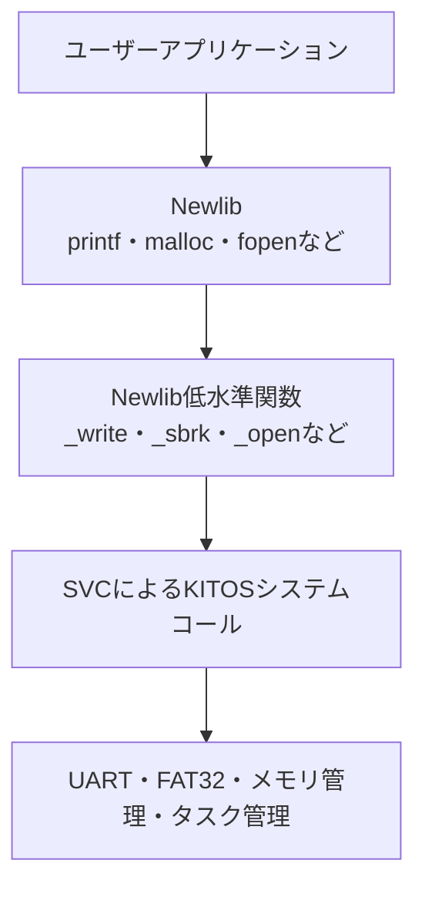
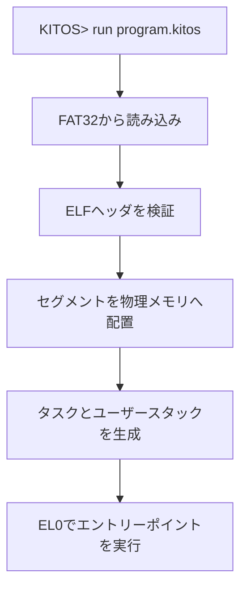

# KITOS（キートス）

Raspberry Pi 4 Model B向けに開発している、AArch64ベアメタル環境で動作するDOSライクOSです。

## 概要

KITOSは、Raspberry Pi 4 Model Bなどの現代的なコンピュータ上で動作する、小規模で理解しやすいDOSライクOSを設計・実装するプロジェクトです。

このプロジェクト以前にも、`KIT-OS`という名称で自作OSを開発していました。以前のKIT-OSでは、初めて汎用OSを開発する段階でありながら、次のような多くの機能を同時に実現しようとしていました。

- x86_64／UEFIとAArch64への対応
- 仮想メモリ
- 独自ファイルシステム
- 複数アーキテクチャで共通利用できるカーネル
- 高機能な汎用OSとしての構成

しかし、設計規模が急速に大きくなり、各機能を十分に完成・検証できないまま開発が停滞しました。結果として、当初のKIT-OS開発は失敗し、設計と実装範囲を見直すことになりました。

その反省から、現在のKITOSでは対象をRaspberry Pi 4 Model BとAArch64に絞り、UART、割込み、タスク管理、ファイルシステム、シェル、アプリケーション実行環境を段階的に実装しています。

LinuxやWindowsのような大規模OSを目指すのではなく、OSを構成する各機能の関係を追跡でき、自分自身で説明できる規模に収めることを重視しています。

## 目的

KITOSの主な目的は、次のOS基本機能を実際に設計・実装し、その仕組みを理解することです。

- AArch64ベアメタル環境での起動
- UARTによる入出力
- 例外および割込み処理
- タイマ割込み
- コンテキストスイッチ
- タスクおよびスケジューリング
- FAT32ファイルシステム
- コマンドラインシェル
- ユーザーアプリケーションの実行
- システムコール
- メモリ管理

本プロジェクトは、大学の卒業研究として開発しています。

## DOSライクについて

KITOSにおける「DOSライク」とは、キーボードと文字表示を中心とする単純なコマンドライン環境を意味します。

MS-DOSとのAPI互換性や、既存のMS-DOS用バイナリを実行することは目的としていません。

現代OSのような複雑な構造を最初から導入するのではなく、MS-DOSや初期UNIXのように、OS内部の処理を把握しやすい構成を目指しています。

## 対象環境

| 項目 | 内容 |
| --- | --- |
| 対象機種 | Raspberry Pi 4 Model B |
| CPUアーキテクチャ | ARM64／AArch64 |
| 主な実装言語 | C、AArch64アセンブリ |
| 実行環境 | ベアメタル |
| ストレージ | SDカード |
| ファイルシステム | FAT32 |
| 入出力 | UART／シリアル端末 |
| 検証環境 | Raspberry Pi 4B、QEMU |
| カーネルイメージ | `kernel8.img` |

Raspberry Piのファームウェアから`kernel8.img`を起動する構成を基本とし、U-Bootなどの高機能なブートローダーには依存しない方針です。

## 現在の開発状況

現在は、KITOS上でシェルを起動し、FAT32ファイルシステム上のファイルやディレクトリを操作できる段階まで開発しています。

また、テキストエディタを使用してBASICプログラムを作成・保存し、Tiny BASICインタプリタで読み込んで実行する一連の動作を確認しています。

```text
DOS> editor

 EDIT     /test/test.BAS
   1 10 PRINT "hello dos!!"
   2 END

Arrow keys move the cursor. Ctrl+S saves. Ctrl+X exits.
```

保存したプログラムはTiny BASICから実行できます。

```text
DOS> basic
Tiny BASIC / integer A-Z / HELP for commands
BASIC> LOAD test.BAS
Loaded
BASIC> RUN
hello dos!!
BASIC>
```

## 実装状況

| 分類 | 機能 | 状況 |
| --- | --- | --- |
| 起動 | AArch64カーネルの起動 | 実装済み |
| 起動 | BSS領域の初期化 | 実装済み |
| 入出力 | UARTによる文字入出力 | 実装済み |
| 例外 | AArch64例外ベクタ | 実装済み |
| 割込み | GICv2制御 | 実装済み |
| 割込み | タイマ割込み | 実装済み |
| タスク | ARM64コンテキストスイッチ | 実装済み |
| タスク | 複数タスクの実行 | 実装済み |
| タスク | ラウンドロビンスケジューリング | 実装済み |
| タスク | スリープ／時限待ち | 実装予定 |
| 同期 | セマフォ | 開発中 |
| ストレージ | SDカードアクセス | 実装済み |
| ファイルシステム | FAT32読み込み | 実装済み |
| ファイルシステム | FAT32書き込み | 実装済み |
| ファイルシステム | ファイル作成・保存 | 実装済み |
| ファイルシステム | ディレクトリ操作 | 実装済み |
| シェル | 対話型コマンドライン | 実装済み |
| アプリケーション | テキストエディタ | 実装済み |
| アプリケーション | Tiny BASIC | 実装済み |
| システムコール | カーネル機能の呼び出し | 開発中 |
| ユーザーモード | EL0でのプログラム実行 | 開発予定 |
| 実行形式 | ELFローダ | 開発予定 |
| メモリ管理 | ユーザー領域の管理 | 開発予定 |
| 仮想メモリ | ページングとアドレス空間分離 | 将来構想 |

「実装済み」は、現在の開発環境で動作を確認した機能を示します。実機とQEMUでは周辺機器の挙動が異なるため、両方で同等の動作を保証するものではありません。

## シェル

起動後は、`DOS>`プロンプトからコマンドを入力します。

```text
DOS> help
DOS> pwd
/
DOS> ls
DOS> mkdir test
DOS> cd test
DOS> touch test.BAS
DOS> editor
```

主なシェルコマンドは次のとおりです。

| コマンド | 概要 |
| --- | --- |
| `help` | 使用可能なコマンドを表示する |
| `clear` | 画面をクリアする |
| `pwd` | 現在のディレクトリを表示する |
| `ls` | ファイルとディレクトリの一覧を表示する |
| `cd` | 現在のディレクトリを変更する |
| `mkdir` | ディレクトリを作成する |
| `touch` | 空のファイルを作成する |
| `cat` | ファイルの内容を表示する |
| `editor` | テキストエディタを起動する |
| `basic` | Tiny BASICを起動する |
| `run` | プログラムまたは組み込みアプリケーションを起動する |
| `ps` | タスクの一覧を表示する |
| `mem` | メモリの状態を表示する |

コマンドの種類や引数は、開発に伴って変更される可能性があります。

## テキストエディタ

KITOSには、UART端末上で動作する簡易テキストエディタを実装しています。

現在の主な操作は次のとおりです。

| 操作 | 内容 |
| --- | --- |
| 矢印キー | カーソルを移動する |
| `Ctrl+S` | ファイルを保存する |
| `Ctrl+X` | エディタを終了する |

BASICのソースファイルなど、シェル上で使用するテキストファイルをKITOS内で直接編集できます。

## Tiny BASIC

KITOSには、簡易的なBASICインタプリタを実装しています。

現在は、行番号付きプログラムをファイルから読み込み、実行できます。

```basic
10 PRINT "hello dos!!"
20 END
```

```text
BASIC> LOAD test.BAS
Loaded
BASIC> RUN
hello dos!!
BASIC>
```

主なコマンドは次のとおりです。

| コマンド | 内容 |
| --- | --- |
| `LOAD` | BASICソースファイルを読み込む |
| `RUN` | 読み込んだプログラムを実行する |
| `HELP` | 使用可能なコマンドを表示する |

変数は整数型の`A`から`Z`までを基本としています。

## タスク管理

KITOSでは、複数のタスクを実行するためのコンテキストスイッチとスケジューラを実装しています。

現在は、タイマ割込みを利用したラウンドロビン方式を基本としています。

```text
DOS> run demo_a
Started demo_a: id=2
[task 2] demo_a is running
[task 2] demo_a is running
```

現在は、次の機能を実装しています。

- タスクの生成
- タスクIDの割り当て
- 実行可能タスクの管理
- コンテキストスイッチ
- ラウンドロビンスケジューリング
- タイマによるプリエンプション

今後は、次の機能を追加する予定です。

- スリープ状態の管理
- 終了したタスクの回収

## ファイルシステム

ファイルシステムにはFAT32を採用しています。

独自ファイルシステムを一から設計するのではなく、既存の仕様を持つFAT32を実装することで、SDカードを介してホストPCとファイルを交換できる構成を目指しています。

現在は、次の処理を実装しています。

- FAT32ボリュームの認識
- ディレクトリエントリの読み込み
- パスの解決
- ファイルの読み込み
- ファイルの書き込み
- ファイルの作成
- ディレクトリの作成
- ディレクトリ内のファイル一覧取得

ファイルシステムの書き込み処理は、電源断や異常終了時の完全な整合性を保証する段階には達していません。重要なデータを保存したSDカードでの実行は推奨しません。

## システムコールとNewlib（将来計画）

将来的には、AArch64の`SVC`命令を利用したシステムコールを実装し、EL0で動作するユーザーアプリケーションからEL1のカーネル機能を呼び出せるようにする予定です。

システムコールを実装する主な目的の一つは、ユーザーランドへNewlibを導入することです。

文字列操作、入出力、メモリ確保などの標準的なライブラリ機能をすべて独自に実装・保守することは開発負担が大きいため、既存のC標準ライブラリ実装であるNewlibを利用します。これにより、ライブラリを一から作成する手間を減らし、カーネル、タスク管理、ファイルシステムなど、KITOS固有の機能の開発へ集中できるようにします。

Newlib自体がハードウェアを直接操作するわけではないため、KITOS側でNewlibとカーネルを接続するシステムコール層を用意する必要があります。

導入時には、少なくとも次のNewlib移植用の低水準関数を実装する予定です。これらの関数内部から、KITOS固有のシステムコールを呼び出します。

| Newlib移植用関数 | 用途 |
| --- | --- |
| `_write` | UART、端末またはファイルへの出力 |
| `_read` | UART、端末またはファイルからの入力 |
| `_open` | ファイルを開く |
| `_close` | ファイルを閉じる |
| `_lseek` | ファイルの読み書き位置を変更する |
| `_fstat` | ファイルの状態を取得する |
| `_isatty` | ファイル記述子が端末か判定する |
| `_sbrk` | ユーザーアプリケーションのヒープを拡張する |
| `_exit` | ユーザーアプリケーションを終了する |
| `_getpid` | 現在のプロセスIDを取得する |
| `_kill` | Newlibが要求する最小限のプロセス操作を提供する |

実際のアプリケーションは`printf`や`malloc`などの標準Cライブラリ関数を使用し、Newlib内部の低水準関数からKITOSのシステムコールを呼び出す構成を想定しています。



Newlibの導入と、それに必要なシステムコールは今後の実装予定であり、現在の完成機能ではありません。

## 実行形式とELFローダ（将来構想）

現在のKITOSでは、実行可能なタスクと、そのエントリーポイントをカーネル内へハードコードしています。

この方式は初期段階の動作確認には適していますが、新しいプログラムを追加するたびにカーネルを変更して再ビルドする必要があります。そのため、独立したユーザーアプリケーションを自由に追加・実行できる構成にはなっていません。

将来的には、FAT32ファイルシステム上に保存されたAArch64 ELF形式の実行ファイルを読み込むELFローダを実装したいと考えています。

ファイル名には`.kitos`拡張子を使用することを検討していますが、ファイル内部の形式にはAArch64向けELFを使用する予定です。

ELFローダでは、次の処理を行う予定です。

1. シェルから実行ファイルのパスを受け取る
2. FAT32ファイルシステムからELFファイルを読み込む
3. ELFヘッダとプログラムヘッダを検証する
4. ロード対象のセグメントをメモリへ配置する
5. BSS領域をゼロクリアする
6. ユーザースタックと初期コンテキストを作成する
7. ELFヘッダに記録されたエントリーポイントからタスクを開始する

想定している実行経路は次のとおりです。



ELFローダの導入によって、現在の実行可能タスクのハードコードを廃止し、カーネルとユーザーアプリケーションを分離することを目標としています。

ただし、ELFローダは初期完成の必須要件ではありません。システムコール、ユーザーモード、メモリ管理が整備された後に、開発状況に応じて導入する将来機能として位置付けます。

## 設計方針

KITOSでは、次の方針を重視しています。

- Raspberry Pi 4B／AArch64に対象を絞る
- 小規模で理解しやすいカーネル構造にする
- 一度に多数の機能を実装せず、段階的に検証する
- ボード依存部分と共通カーネル部分を分離する
- シェルやテストプログラムから各機能を検証できるようにする
- 卒業研究として構造と処理を説明できる規模に収める
- 失敗した以前のKIT-OSと同じ過度な多機能化を避ける

ユーザーアプリケーションは、当初は決められた物理メモリ領域へ直接配置し、カーネルが領域の割り当てと解放を管理する方針です。

仮想メモリは初期実装の必須要件とはせず、基本機能が完成した後の拡張機能として扱います。

## 実装しない機能

卒業研究としての実装範囲を明確にするため、初期段階では次の機能を対象外とします。

- マルチユーザー機能
- 高度な権限管理
- ネットワーク機能
- GUIデスクトップ環境
- POSIX完全互換
- Linux互換レイヤ
- x86_64への対応
- UEFIへの対応

仮想メモリとページングによるプロセス分離についても、初期目標ではなく将来的な拡張として扱います。

## 今後の予定

1. FAT32書き込み処理の安定化
2. シェルとファイル操作コマンドの拡充
3. タスク終了・回収処理の整備
4. `sleep`と待ちキューの実装
5. ユーザー用物理メモリ領域の管理
6. EL0ユーザーモードへの移行
7. `SVC`によるシステムコールインターフェースの実装
8. Newlib移植に必要な低水準関数の実装
9. Newlibを利用したユーザーアプリケーションの作成
10. ELFローダの実装
11. 実行可能タスクのハードコード廃止
12. 必要に応じた仮想メモリの導入

使用するツールチェーンやMakefileの構成は、開発状況に応じて変更される可能性があります。

## 注意事項

KITOSは開発途中の実験的なOSです。

- 実装やAPIは予告なく変更される場合があります。
- FAT32書き込み機能には不具合が残っている可能性があります。
- SDカード上のデータが破損する可能性があります。
- 実機で試す場合は、重要なデータが入っていないSDカードを使用してください。
- Raspberry Pi 4BとQEMUでは動作が異なる場合があります。

## 評価項目

KITOSでは、次の項目を段階的な評価基準とします。

- Raspberry Pi 4BまたはQEMU上で起動できるか
- UARTから文字を入出力できるか
- タイマ割込みが一定間隔で発生するか
- 複数タスクを切り替えて実行できるか
- シェルからコマンドを実行できるか
- FAT32上のファイルを読み書きできるか
- エディタで作成したファイルを保存できるか
- BASICプログラムを読み込んで実行できるか
- ユーザーアプリケーションを起動できるか
- アプリケーション終了後にシェルへ戻れるか

## 本プロジェクトの位置付け

KITOSは、LinuxやWindowsに代わる大規模な汎用OSを目指すものではありません。

また、機能数の多さや既存OSとの互換性を競うことも目的としていません。

以前のKIT-OS開発で、実装範囲を広げすぎたために開発を完遂できなかった経験を踏まえ、現在のKITOSでは次の点を重視しています。

- 一つずつ実装して動作を確認すること
- ハードウェアからユーザーアプリケーションまでの流れを理解すること
- ソースコードと設計を自分自身で説明できること
- 小規模であっても、実際に操作できる一つのOSとして完成させること

KITOSは、失敗した以前の設計を捨てるだけではなく、その失敗から実装範囲と開発順序を学び直して進めている教育用OSプロジェクトです。
